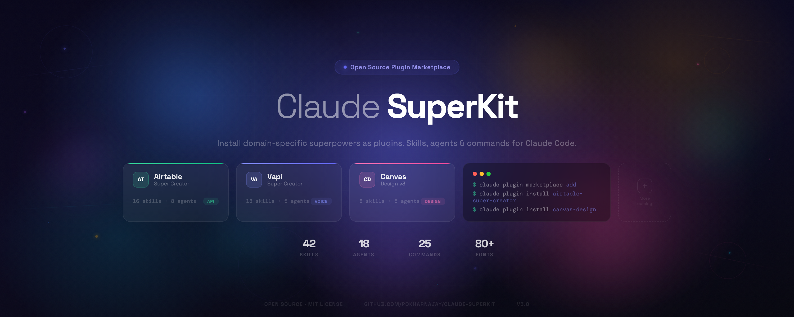

# Claude Superkit



A marketplace of Claude Code plugin bundles — installable skill packs that extend Claude Code with domain-specific superpowers.

## Bundles

| Bundle | Description | Skills | Agents | Commands |
|--------|-------------|--------|--------|----------|
| [airtable-super-creator](airtable-super-creator/) | Complete Airtable development toolkit — manage bases, tables, fields, records, views, webhooks, and more via the Airtable Web API | 16 | 8 | 10 |
| [vapi-super-creator](vapi-super-creator/) | Complete voice AI toolkit for Vapi — build assistants, tools, squads, workflows, phone numbers, and webhooks | 18 | 5 | 7 |
| [canvas-design](canvas-design/) | Production-grade visual design with HTML/CSS + Playwright — covers, posters, social media, thumbnails, brand assets, abstract art | 8 | 5 | 8 |
| [remotion-video-creator](remotion-video-creator/) | Professional video creation with Remotion (React/TypeScript) — social media, explainers, kinetic typography, data viz, slideshows, audiograms, intros/outros, news highlights | 9 | 6 | 7 |

## Setup & Prerequisites

Each bundle may require external tools or API keys. Set these up before first use.

### airtable-super-creator

**API Key Required:** Airtable Personal Access Token

```bash
# 1. Go to https://airtable.com/create/tokens
# 2. Create a token with the scopes you need (data.records:read, data.records:write, schema.bases:read, etc.)
# 3. Set the environment variable:
export AIRTABLE_ACCESS_TOKEN="patXXXXXXXXXXXXXX"

# Or add to your project's .claude/settings.json:
# { "env": { "AIRTABLE_ACCESS_TOKEN": "patXXXXXXXXXXXXXX" } }
```

### vapi-super-creator

**API Key Required:** Vapi Private API Key

```bash
# 1. Go to https://dashboard.vapi.ai → Settings → API Keys
# 2. Copy your Private Key
# 3. Set the environment variable:
export VAPI_API_KEY="your-vapi-private-key"

# Or add to your project's .claude/settings.json:
# { "env": { "VAPI_PRIVATE_API_KEY": "your-vapi-private-key" } }
```

### canvas-design

**Prerequisite:** Playwright MCP plugin (for HTML-to-PNG rendering)

```bash
# Playwright MCP is typically auto-available in Claude Code via the built-in plugin.
# No API key needed. Ensure the Playwright MCP tools are enabled in your settings.
# 80+ bundled fonts are included — no font installation required.
```

### remotion-video-creator

**Prerequisite:** Node.js 18+ and a Remotion project

```bash
# 1. Install Node.js 18+ (https://nodejs.org)
# 2. Create a new Remotion project (or use an existing one):
npx create-video@latest my-video
cd my-video
npm install

# 3. Ensure Chrome headless is available:
npx remotion browser ensure

# No API key needed for basic video creation.
# Optional: ElevenLabs API key for AI voiceover generation
export ELEVEN_LABS_API_KEY="your-elevenlabs-key"
```

## Installation

**Step 1:** Register the marketplace (one-time):

```bash
claude plugin marketplace add pokharnajay/claude-superkit
```

**Step 2:** Install the plugins you want:

```bash
# Install for all projects (user scope — default)
claude plugin install airtable-super-creator@claude-superkit
claude plugin install vapi-super-creator@claude-superkit
claude plugin install canvas-design@claude-superkit
claude plugin install remotion-video-creator@claude-superkit

# Install for the current project only (shared via git)
claude plugin install airtable-super-creator@claude-superkit --scope project
claude plugin install vapi-super-creator@claude-superkit --scope project
claude plugin install canvas-design@claude-superkit --scope project
claude plugin install remotion-video-creator@claude-superkit --scope project

# Install locally (not shared with team)
claude plugin install airtable-super-creator@claude-superkit --scope local
claude plugin install vapi-super-creator@claude-superkit --scope local
claude plugin install canvas-design@claude-superkit --scope local
claude plugin install remotion-video-creator@claude-superkit --scope local
```

### Installation Scopes

| Scope | Stored in | Shared via git? | Use case |
|-------|-----------|-----------------|----------|
| `user` (default) | `~/.claude/plugins/` | No | Personal — available in all your projects |
| `project` | `.claude/plugins/` in project root | Yes | Team — everyone who clones the repo gets it |
| `local` | `.claude/plugins/` (gitignored) | No | Personal per-project — only you, only this project |

## CLI Reference

### Marketplace Management

```bash
# Add a marketplace (one-time registration)
claude plugin marketplace add owner/repo

# List all registered marketplaces
claude plugin marketplace list

# Update all marketplaces (fetch latest from GitHub)
claude plugin marketplace update

# Update a specific marketplace
claude plugin marketplace update claude-superkit

# Remove a marketplace
claude plugin marketplace remove claude-superkit
```

### Plugin Management

```bash
# Install a plugin (default: user scope)
claude plugin install plugin-name@marketplace-name

# Install with a specific scope
claude plugin install plugin-name@marketplace-name --scope user      # all projects (default)
claude plugin install plugin-name@marketplace-name --scope project   # current project, shared via git
claude plugin install plugin-name@marketplace-name --scope local     # current project, not shared

# List all installed plugins
claude plugin list

# Update a plugin to the latest version (restart required)
claude plugin update plugin-name@marketplace-name

# Uninstall a plugin
claude plugin uninstall plugin-name@marketplace-name
```

### Enable / Disable Plugins

```bash
# Temporarily disable a plugin (without uninstalling)
claude plugin disable plugin-name@marketplace-name

# Disable with a specific scope
claude plugin disable plugin-name@marketplace-name --scope project

# Disable all plugins at once
claude plugin disable --all

# Re-enable a disabled plugin
claude plugin enable plugin-name@marketplace-name

# Re-enable with a specific scope
claude plugin enable plugin-name@marketplace-name --scope project
```

### Validate

```bash
# Validate a plugin or marketplace structure
claude plugin validate ./path-to-plugin-or-marketplace
```

### Load Plugins for a Single Session

```bash
# Use a local plugin directory without installing (great for development/testing)
claude --plugin-dir ./path-to-plugin
```

## Repository Structure

```
claude-superkit/
├── airtable-super-creator/       # Airtable plugin bundle
│   ├── .claude-plugin/
│   ├── skills/                   # 16 skills
│   ├── agents/                   # 8 agents
│   ├── commands/                 # 10 commands
│   ├── hooks/
│   └── docs/
├── vapi-super-creator/           # Vapi voice AI plugin bundle
│   ├── .claude-plugin/
│   ├── skills/                   # 18 skills
│   ├── agents/                   # 5 agents
│   ├── commands/                 # 7 commands
│   ├── hooks/
│   └── docs/
├── canvas-design/                # Visual art & design plugin
│   ├── .claude-plugin/
│   ├── skills/                   # 8 skills + 80+ fonts
│   ├── agents/                   # 5 agents
│   ├── commands/                 # 8 commands
│   └── hooks/
├── remotion-video-creator/       # Video creation plugin
│   ├── .claude-plugin/
│   ├── skills/                   # 9 sub-skills
│   ├── agents/                   # 6 agents
│   ├── commands/                 # 7 commands
│   ├── references/               # 10 shared knowledge files
│   ├── templates/                # 8 reusable TSX components
│   └── hooks/
├── .claude-plugin/
│   └── marketplace.json         # Marketplace manifest
├── LICENSE
└── README.md
```

## Links

- **GitHub:** [pokharnajay/claude-superkit](https://github.com/pokharnajay/claude-superkit)
- **Notion:** [Claude Skills - SuperKit](https://www.notion.so/Claude-Skills-SuperKit-32011c9d2b3981129409d244cf2e5475)

<!-- Notion Page ID: 32011c9d-2b39-8112-9409-d244cf2e5475 -->

## License

MIT — see [LICENSE](LICENSE) for details.
